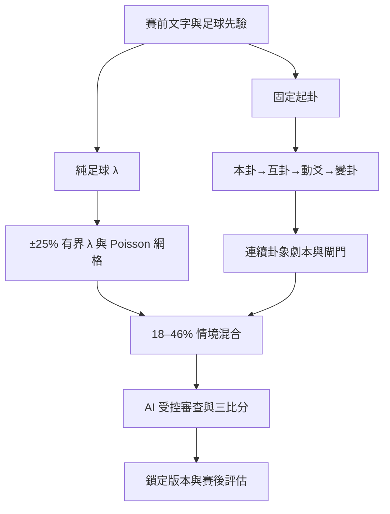

# 梅花易數足球 AI 自主推理系統 v4.1

這是一個以 Streamlit、GitHub Contents 與 GitHub Models 建立的足球賽前研究系統。它把「足球先驗」、「連續卦象劇本」與「AI 審查」分層處理，保存不可覆寫的賽前版本，再於賽後回填 90 分鐘結果，檢驗卦象劇本與 AI 是否真的帶來增益。

> 僅供研究、紀錄與回測；不提供投注建議，不含自動投注或任何真實資金功能。

## v4.1 核心原則

1. 只判斷 90 分鐘常規時間，不含延長賽與 PK。
2. 賽前預測只能使用開賽前可知資料，本場實際比分永遠不進入賽前流程。
3. 支持方向只決定體方與用方，不會改變實力分數。
4. 純足球先驗先建立雙方期望進球 λ。
5. 體、用、本卦、互卦、動爻、體用轉象、變卦與五行生剋必須形成一條有時序的比賽劇本。
6. 分開估計比賽動能、破門通道、能量歸屬、終局收束與波動；動能高不自動等於高比分。
7. 卦象對單方 λ 的修正仍限制在 ±25%；劇本只以 18–46% 可稽核情境權重重排比分網格。
8. 同卦同數先判斷鏡像對消或同數共振；卦數只作有條件的次級錨點，不直接等同進球。
9. 單場賽果產生的規則一律是 `hypothesis`，預測權重為 0；通過留出驗證後才能升級。
10. 每次不同的賽前預測會建立新版本；已回填的實際比分與校準內容不可被重新預測覆蓋。
11. 足球基線、有界 λ、卦象劇本、AI 與最終排序分開保存與評估。

## 預測流程



## 功能

- 體方段落、用方段落與完整中性段落的固定字數計算。
- 體卦、用卦、本卦、互卦、動爻、體用轉象、變卦與五行生剋。
- 客觀足球先驗：體方實力、用方實力、先驗可信度與場地。
- 足球基線 λ、卦象倍率、修正後 λ、劇本期望進球、勝平負機率與五球以上尾部機率。
- 動能、破門通道、收束、波動、體用能量歸屬與各方完成通道的分數化審計。
- 鏡像對消／同數共振、零球／高比分／大勝／BTTS 閘門與動爻時窗。
- 有觸發理由的總球錨點、卦數次級錨點與比分劇本候選。
- 單方 0–10 球比分網格，不再把高比分硬壓回 0–2 球。
- 結構相似度與純 Python 字元 n-gram TF-IDF 案例檢索。
- GitHub Models 結構化 JSON 證據融合；失敗時自動退回固定引擎。
- 平衡候選池與方向保護，AI 不能創造網格外比分。
- 賽前內容雜湊、版本序號、前一版本連結與不覆寫報告。
- 獨立賽後校準中心。
- 足球基線、卦象規則、AI、最終排序的分層指標。
- v4 盲測使用 Brier score、LogLoss、勝平負命中、首選／前三比分與比分距離。
- GitHub Actions 在 Python 3.12、3.13 執行編譯、靜態錯誤檢查與測試。

## 專案結構

```text
app.py                         Streamlit 入口
app_v33.py                     現行 UI（保留檔名以相容既有部署）
version.py                     系統、資料結構、規則與 Prompt 版本
config.py                      Secrets 與執行設定
models.py                      資料結構
football_prior.py              純足球 λ 與 Poisson 基線
meihua_engine.py               字數、體用、本互動變、五行
score_engine.py                足球先驗 × 卦象有界修正
hexagram_script.py             連續卦象劇本、閘門、數路與比分原型
evaluation.py                  候選控制、命中、Brier 與 LogLoss
case_memory.py                 相似案例與同場排除
ai_reasoner_v33.py             現行 GitHub Models 證據融合
storage_v33.py                 v4.1 資料遷移、劇本審計、鎖定與 GitHub 後台
calibration_center.py          賽後回填與人工確認
metrics_dashboard.py           分層成績與 v4 盲測
report_builder_v33.py          完整賽前報告與決策審計
knowledge/                     八卦、六十四卦、規則與來源
data/meihua_cases.csv          案例庫（舊欄位自動遷移）
reports/                       內容雜湊命名的鎖定報告
docs/                          架構、資料、模型、評估與操作文件
tests/                         離線、資料安全與 Streamlit 冒煙測試
```

`*_v32.py`、`*_v33.py` 中仍有部分相容層，目的是讓既有 Streamlit 部署與舊 CSV 不需一次性破壞式遷移。正式入口只有 `app.py`；決策控制的唯一實作位於 `evaluation.py`。

## 快速開始

需要 Python 3.12 或 3.13。

```bash
python -m venv .venv
source .venv/bin/activate
python -m pip install -r requirements-dev.txt
streamlit run app.py
```

Windows PowerShell 啟用虛擬環境：

```powershell
.venv\Scripts\Activate.ps1
```

## Streamlit Secrets

複製 `.streamlit/secrets.toml.example` 的內容到 Streamlit Community Cloud 的 Secrets 設定，不要把真正的 `secrets.toml` 提交到 GitHub。

```toml
GITHUB_TOKEN = "Repository Contents 可讀寫 Token"
GITHUB_REPO = "wujoshnjr/meihua-football-streamlit"
GITHUB_BRANCH = "main"
GITHUB_CASES_PATH = "data/meihua_cases.csv"
GITHUB_REPORTS_DIR = "reports"

GITHUB_MODELS_TOKEN = "Models 唯讀 Token"
AI_ENABLED = true
AI_PROVIDER = "github_models"
AI_MODEL = "openai/gpt-4.1-mini"
AI_TOP_K_CASES = 5
AI_MAX_OUTPUT_TOKENS = 2400
AI_TEMPERATURE = 0.2
AI_REQUIRE_CONFIRMATION = true
```

- `GITHUB_TOKEN`：只用於讀寫案例 CSV 與 Markdown 報告。
- `GITHUB_MODELS_TOKEN`：只需 Models 唯讀權限。
- 兩把 Token 應分開、定期輪替，且不得出現在程式碼、報告或測試輸出。

模型 ID 可能隨 GitHub Models catalog 變動；部署後可在側邊欄用「測試 AI 連線與模型」核對。

## 五個賽前輸入區

1. 體方段落。
2. 用方段落。
3. 完整賽前中性介紹段落（只此段計算動爻）。
4. 賽前補充資料（不參與字數）。
5. 賽前足球先驗（不參與字數）：體方實力、用方實力、可信度與場地。

系統不會自行抓取即時比分或賽後資料。資料來源與輸入規範見 [DATA_SOURCES.md](docs/DATA_SOURCES.md)。

## 賽前鎖定與版本

- 第一次儲存會建立案例 ID、完整 SHA-256 預測雜湊與版本 1。
- 相同雜湊再次儲存是冪等操作，不會新增重複案例，也不會清空賽後欄位。
- 同一場比賽的輸入、規則、AI 或最終排序改變時，建立新版本並記錄 `取代案例ID`。
- 報告以內容雜湊命名，後續版本不會覆蓋舊報告。
- 賽後中心只修改結果、評估與校準欄位，不改寫賽前文字、卦象、λ、候選或版本。

## 規則治理

規則狀態與預測權重：

| 狀態 | 用途 | 權重 |
|---|---|---:|
| `hypothesis` | 單場結果提出、尚未留出驗證 | 0% |
| `general` | 多案例的一般弱先驗 | 20% |
| `reviewed` | 已人工審查、仍需更多樣本 | 35% |
| `verified` | 已通過預先定義的留出驗證 | 100% |

規則即使生效，雙方 λ 仍受 ±25% 總上限約束；精確比分樣式的綜合倍率也限制在 0.75–1.25。v4.1 另以最高 46% 的劇本情境分布與 Poisson 網格混合，不會偷偷改寫 λ，且每個受支持比分都有閘門與理由。詳見 [HEXAGRAM_SCRIPT.md](docs/HEXAGRAM_SCRIPT.md) 與 [RULE_GOVERNANCE.md](docs/RULE_GOVERNANCE.md)。

## 評估

v4／v4.1 只把以下案例計入正式盲測：

- 系統版本以 `4` 開頭；版本比較時另按 4.0 與 4.1 分層；
- 賽前狀態為 `已鎖定`；
- 之後才回填有效的 90 分鐘實際比分；
- 預測內容雜湊與版本仍完整。

主要比較：

- 足球基線 vs 卦象調整：勝平負 Brier、LogLoss、方向命中、比分距離。
- 卦象規則 vs AI：首選與前三比分、勝平負、比分距離。
- 最終排序：首選、前三、BTTS、大小 2.5 與進球誤差。

舊案例可以作歷史檢索與回歸參考，但不會冒充 v4 的前瞻盲測成績。完整定義見 [EVALUATION_METHOD.md](docs/EVALUATION_METHOD.md)。

## 測試

```bash
python -m compileall -q .
ruff check --select E9,F63,F7,F82 .
pytest -q
```

測試涵蓋：

- 字數與已知起卦結果。
- 足球先驗 λ 與高比分尾部。
- 卦象 ±25% 上限。
- 384 種體卦×用卦×動爻的機率守恆與比分多樣性。
- 雙乾鏡像對消、雙兌同數共振、封閉零球、關係反轉、對攻與大勝尾部。
- 單場規則權重為 0。
- 平衡候選池與 AI 方向保護。
- 同場案例排除。
- 舊 CSV 遷移。
- 賽前鎖定不可被賽後資料覆蓋。
- Brier／LogLoss 與舊案例指標。
- Streamlit 完整入口冒煙測試。

## 舊版升級

1. 先下載並備份 `data/meihua_cases.csv`。
2. 部署 v4.1 程式，但保留原 CSV、`reports/` 與 Streamlit Secrets。
3. 開啟 App；讀取時會在記憶體中補齊新欄位，不會刪除未知舊欄位。
4. 先確認舊案例仍可在賽後中心與成績頁顯示。
5. 用一場測試比賽建立 v4.1 鎖定版本，確認「卦線劇本」頁籤與新欄位後再回填測試結果。
6. 確認 GitHub 中案例 CSV 與雜湊命名報告均已寫入。

詳細步驟見 [UPGRADE_CHECKLIST.md](UPGRADE_CHECKLIST.md) 與 [OPERATIONS.md](docs/OPERATIONS.md)。

## 文件

- [ARCHITECTURE.md](docs/ARCHITECTURE.md)：模組、資料流與信任邊界。
- [HEXAGRAM_SCRIPT.md](docs/HEXAGRAM_SCRIPT.md)：連續卦象劇本、閘門、數路與情境混合。
- [DATA_SOURCES.md](docs/DATA_SOURCES.md)：賽前資料與禁止輸入。
- [DATA_SCHEMA.md](docs/DATA_SCHEMA.md)：案例欄位、遷移與鎖定語意。
- [MODEL_CARD.md](docs/MODEL_CARD.md)：用途、限制與風險。
- [EVALUATION_METHOD.md](docs/EVALUATION_METHOD.md)：前瞻盲測與指標。
- [RULE_GOVERNANCE.md](docs/RULE_GOVERNANCE.md)：假說升級流程。
- [OPERATIONS.md](docs/OPERATIONS.md)：部署、備份與故障處理。
- [GITHUB_ACTIONS_WORKFLOW.md](docs/GITHUB_ACTIONS_WORKFLOW.md)：CI 工作流程。

## 已知限制

- 0–100 實力分仍是人工輸入的摘要先驗，不是由完整賽事資料自動訓練的專業 xG 模型。
- Poisson 基線假設雙方進球近似獨立，無法完整表達紅牌、戰術切換或比分狀態依賴。
- 梅花易數足球映射是本專案的研究假說，不是傳統經典中的固定比分規則。
- 劇本分數與閘門是明示的啟發式規則，不是由大型標註資料集訓練出的機率模型；版本間必須分開盲測。
- 樣本量小時，任何命中率、Brier 或 AI 增益都具有高不確定性。
- GitHub Contents 適合單人、小流量研究；多人高併發應改用具交易與版本控制的資料庫。

## 官方技術參考

- GitHub Models：<https://docs.github.com/en/github-models>
- GitHub REST Contents API：<https://docs.github.com/en/rest/repos/contents>
- Streamlit Secrets：<https://docs.streamlit.io/deploy/streamlit-community-cloud/deploy-your-app/secrets-management>
- Python `math` Poisson 計算基礎：<https://docs.python.org/3/library/math.html>
