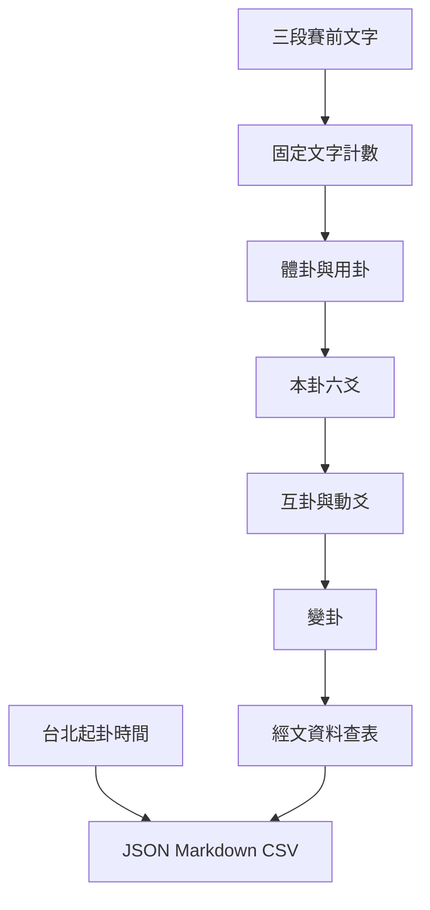

# v5 架構

## 信任邊界

v5 只有兩個工作層：

1. 決定式排卦：三段文字依固定計數法產生體卦、用卦、本卦、互卦、動爻與變卦。
2. 只讀知識資料：依卦名與爻位顯示經文，不把經文轉換成具體事件判斷。

每次按下排卦時另行擷取 `Asia/Taipei` 時間並換算農曆年月日與時辰。時間只屬稽核資料，不會進入文字計數或改變卦象。

系統沒有 AI、機率模型、足球實力、比分演算法或賽後學習回路。

## 模組

- `app.py`：Streamlit 表單、排盤、知識瀏覽、紀錄下載。
- `meihua_engine.py`：文字計數與本互動變計算。
- `casting_time.py`：台北時區時間快照與農曆／時辰換算。
- `models.py`：輸入與排卦結果資料結構。
- `knowledge_loader.py`：8／64／384 完整性驗證與快取。
- `report_builder.py`：只含排盤與經文的 Markdown 報告。
- `storage.py`：本機與 GitHub Contents 排卦紀錄。
- `knowledge/`：八卦、六十四卦、易傳與方法規格。

## 資料流

## 不變條件

- 六爻均自下而上儲存。
- 體卦固定在下，用卦固定在上。
- 互卦固定取二三四、三四五爻。
- 只反轉一個動爻。
- 每次排卦結果必須可由原始文字重算。
- 起卦時間只作紀錄，不得參與排卦取數。
- 知識庫啟動時必須通過 8 卦、64 卦、384 爻完整性驗證。
