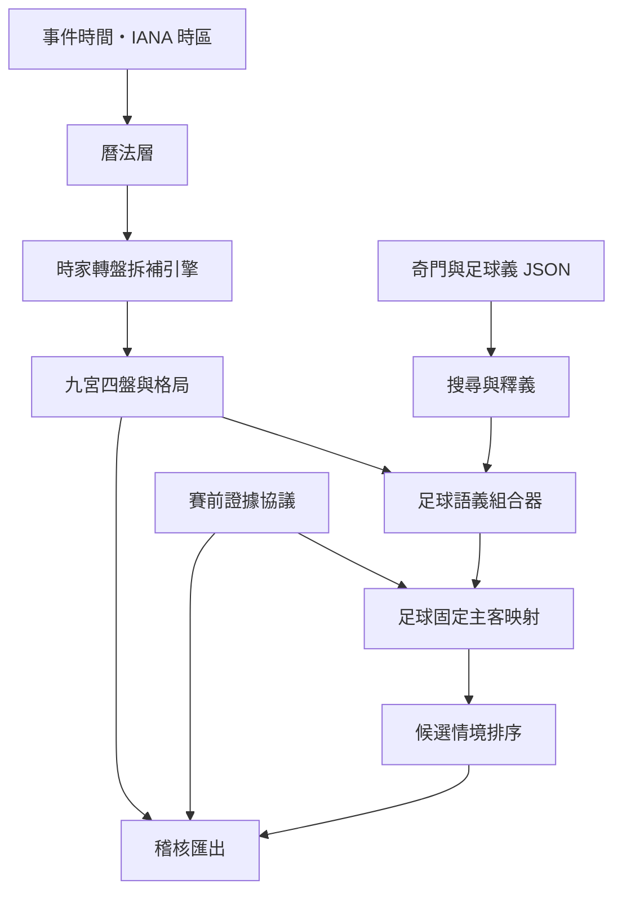

# 系統架構

## 分層原則

系統刻意把傳統排盤、知識內容、足球映射與資料稽核拆開。這可防止「古籍定義」「本專案約定」與「現實賽事證據」彼此污染。

```mermaid
flowchart TD
    A[事件時間・IANA 時區] --> B[曆法層]
    B --> C[時家轉盤拆補引擎]
    C --> D[九宮四盤與格局]
    K[奇門與足球義 JSON] --> E[搜尋與釋義]
    D --> S[足球語義組合器]
    E --> S
    S --> F[足球固定主客映射]
    P[賽前證據協議] --> F
    F --> G[候選情境排序]
    D --> H[稽核匯出]
    P --> H
    G --> H
```

## 模組責任

| 模組 | 單一責任 | 不負責 |
|---|---|---|
| `qimen.calendar` | 時區、四柱、前後節氣、六旬 | 奇門判讀 |
| `qimen.engine` | 陰陽遁、局數、天地人神盤、可驗證格局 | 足球勝負 |
| `qimen.knowledge` | 載入、扁平化、搜尋版本化 JSON | 改寫排盤條件 |
| `qimen.football_ontology` | 足球義反查、層次組合、五行關係與覆蓋統計 | 勝負或統計機率 |
| `qimen.football` | 盤前固定主客用神、盤內情境排序 | 統計機率或賠率 |
| `qimen.protocol` | freeze_at、資料時點、對稱更新、賽果口徑 | 網路抓取 |
| `qimen.reporting` | 可重現匯出與指紋 | 永久雲端儲存 |
| `qimen.evaluation` | 賽前鎖定情境的賽後一致性評估 | 回訓或回灌賽前報告 |

## 可重現性

一張盤的身份至少包含：事件 ISO 時刻、IANA 時區、節氣時刻、四柱、方法版本、寄宮規則、子時規則與足球映射版本。足球義按固定順序由宮、門、星、神、干支、旺衰、狀態與格局組成；匯出包會連同完整足球義計算 SHA-256，內容一旦變更，指紋也會改變。

## 錯誤邊界

- 不存在的夏令時間會被拒絕，不自動平移一小時。
- 未安裝固定曆法依賴時明確報錯。
- 非轉盤或非拆補方法不會悄悄退回預設值。
- 有爭議的格局條件標記為 `knowledge_only`，不自動命中。
- 證據時間缺時區、在開賽後發布／擷取，或違反 freeze 規則時禁止建立研究檔。
