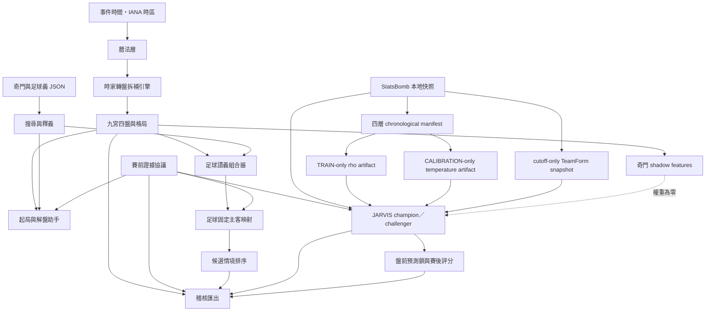

# 系統架構

## 分層原則

系統刻意把傳統排盤、知識內容、足球映射與資料稽核拆開。這可防止「古籍定義」「本專案約定」與「現實賽事證據」彼此污染。

```mermaid
flowchart TD
    A[事件時間・IANA 時區] --> B[曆法層]
    B --> C[時家轉盤拆補引擎]
    C --> D[九宮四盤與格局]
    K[奇門與足球義 JSON] --> E[搜尋與釋義]
    D --> S[足球語義組合器]
    D --> Q[起局與解盤助手]
    E --> S
    E --> Q
    S --> F[足球固定主客映射]
    P[賽前證據協議] --> F
    P --> Q
    F --> G[候選情境排序]
    P --> M[JARVIS champion／challenger]
    O[StatsBomb 本地快照] --> M
    O --> T[四層 chronological manifest]
    O --> FS[cutoff-only TeamForm snapshot]
    T --> R[TRAIN-only rho artifact]
    T --> C2[CALIBRATION-only temperature artifact]
    R --> M
    C2 --> M
    FS --> M
    D --> X[奇門 shadow features]
    X -. 權重為零 .-> M
    M --> V[盤前預測鎖與賽後評分]
    D --> H[稽核匯出]
    P --> H
    G --> H
    M --> H
    V --> H
```

## 模組責任

| 模組 | 單一責任 | 不負責 |
|---|---|---|
| `qimen.calendar` | 時區、四柱、前後節氣、六旬 | 奇門判讀 |
| `qimen.engine` | 陰陽遁、局數、天地人神盤、可驗證格局 | 足球勝負 |
| `qimen.knowledge` | 載入、扁平化、搜尋版本化 JSON | 改寫排盤條件 |
| `qimen.football_ontology` | 足球義反查、層次組合、五行關係與覆蓋統計 | 勝負或統計機率 |
| `qimen.interpretation` | 盤前稽核、固定焦點、306 組關係矩陣、逐宮／逐層指南 | 改動排盤、杜撰古訣或自動應期 |
| `qimen.football` | 盤前固定主客用神、盤內情境排序 | 統計機率或賠率 |
| `qimen.prediction` | 盤前足球輸入、獨立 Poisson／Dixon–Coles、1X2、provenance、奇門 shadow features | 自我校準或投注決策 |
| `qimen.training` | 四層時序 manifest、TRAIN-only rho、CALIBRATION-only temperature artifacts | 讀取 TEST_UNTOUCHED 調參 |
| `qimen.features` | 同 cutoff、同聯賽、時間衰減 TeamForm／xG／聯盟基準 snapshots | 主觀挑選場次或讀取 cutoff 後結果 |
| `qimen.runtime` | 讀取部署環境提供的 Git commit | 猜測或偽造 commit |
| `qimen.providers` | 唯讀本地資料快照正規化與來源檔雜湊 | 猜測時區、靜默下載或改寫上游資料 |
| `qimen.protocol` | EARLY／LINEUP、來源時序、對稱更新、賽果口徑 | 網路抓取 |
| `qimen.reporting` | 可重現匯出與指紋 | 永久雲端儲存 |
| `qimen.evaluation` | 賽前鎖定、完整指標、配對區塊 bootstrap 與奇門治理閘門 | 回訓、回灌賽前報告或自動啟用奇門 |

## 可重現性

一張盤的身份至少包含：事件 ISO 時刻、IANA 時區、節氣時刻、四柱、方法版本、寄宮規則、子時規則、月支旺衰規則與足球映射版本。研究身份另外包含固定問題、足球焦點、鎖定時間與盤前稽核。JARVIS 預測另保存資料截至時間、來源、完整模型輸入、raw／calibrated 機率、模型／特徵版本、artifact 引用、Git commit 與預測鎖。足球義按固定順序由宮、門、星、神、干支、旺衰、狀態與格局組成；匯出包會計算 SHA-256，內容一旦變更，指紋也會改變。

## 錯誤邊界

- 不存在的夏令時間會被拒絕，不自動平移一小時。
- 未安裝固定曆法依賴時明確報錯。
- 非轉盤或非拆補方法不會悄悄退回預設值。
- 有爭議的格局條件標記為 `knowledge_only`，不自動命中。
- 沒有古典固定名稱的關係只標示為五行組合推導，不偽裝成古訣。
- 應期候選只供查詢，沒有預先登記的時間映射不自動指定日期或分鐘。
- 證據時間缺時區、在開賽後發布／擷取，或違反 freeze 規則時禁止建立研究檔。
- 統計資料截止晚於預測鎖、預測鎖不早於開賽，或未確認盤前資料時，不建立正式預測鎖。
- 奇門特徵未通過時間序列增量測試前固定為 `SHADOW_ONLY`，不能調整機率。
